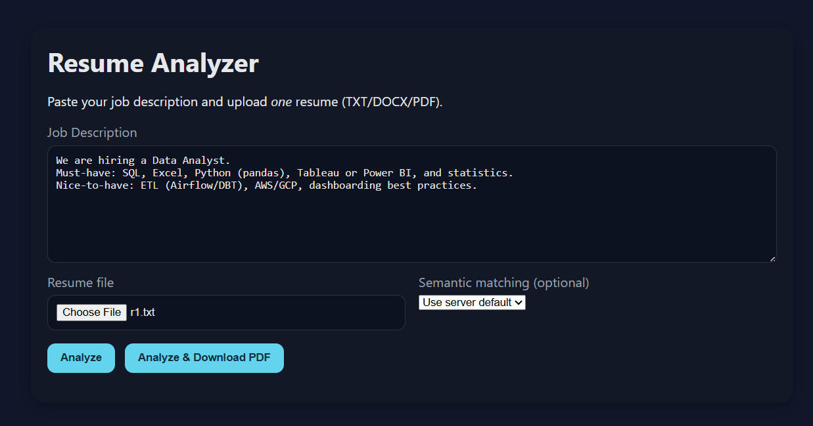
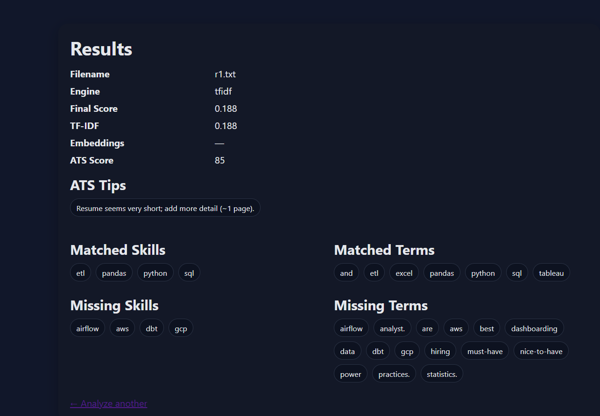

# Resume ATS Analyzer · FastAPI

> Score how well a resume matches a job description — with ATS checks, explainable gaps, suggested roles, and one‑click PDF export.

<p align="center">
  
</p>

<p align="center">
  <a href="https://www.python.org/"></a>
  <a href="https://fastapi.tiangolo.com/"></a>
  <a href="https://scikit-learn.org/"></a>
  <a href="./LICENSE"></a>
</p>

---

## ✨ Features

- **Single JD + single resume** analysis (simple UX)
- **Scoring:** TF‑IDF similarity (optionally blends with embeddings)
- **Explainability:** matched / missing **skills** & **terms**
- **ATS heuristics:** length, section hints, email detection, file type guidance
- **Phrase normalization:** Power BI → `powerbi`, scikit‑learn → `sklearn`, CI/CD → `ci_cd`, etc.
- **Skill Evidence Consistency (SEC):** flags skills listed without supporting evidence in bullets
- **RoleFit Matrix:** suggests better‑fit roles + top missing skills for each role
- **Gap → Action:** micro‑projects, open‑source issues, and learning links per gap
- **PDF report export** (Analyze & Download PDF)
- **Web UI** (dark theme) + **Swagger** API docs

<p align="center">
  
</p>

---

## 🚀 Quickstart

```bash
git clone https://github.com/<your-username>/resume_ats.git
cd resume_ats

python -m venv .venv
# Windows PowerShell:
.\.venv\Scripts\Activate.ps1
# macOS/Linux:
# source .venv/bin/activate

pip install -r requirements.txt
python -m uvicorn app.main:app --reload

# UI   → http://127.0.0.1:8000/ui
# Docs → http://127.0.0.1:8000/docs
```

---

## 🔌 Endpoints (API)

| Endpoint | Method | Purpose |
| --- | --- | --- |
| `/api/analyze/` | POST | Analyze **one JD + one resume** → score, ATS, explanations |
| `/api/analyze/pdf` | POST | Same inputs → **downloadable PDF** report |
| `/api/config/` | GET/PUT | Runtime config (`use_embeddings`, `blend_weight`, `top_k_terms`) |
| `/api/diagnose/sec` | POST | **Skill Evidence Consistency** (claimed vs. supported skills) |
| `/api/diagnose/rolefit` | POST | Suggest **better‑fit roles** + missing skills |
| `/api/diagnose/actions` | POST | **Micro‑projects / OSS issues / learning links** for gaps |
| `/ui` | GET | Web form (paste JD + upload resume) |
| `/ui/analyze` | POST | Results page |
| `/ui/report` | POST | Analyze & download PDF |
| `/health` | GET | Health check (`{"status":"ok"}`) |

**Analyze response (shape)**

```json
{
  "job_description_preview": "…",
  "engine": "tfidf" | "tfidf+embeddings",
  "result": {
    "filename": "resume.pdf",
    "score": 0.72,
    "tfidf_score": 0.72,
    "embed_score": null,
    "ats": { "score": 85, "tips": ["…"] },
    "explanation": {
      "matched_skills": ["python","sql","powerbi","excel","pandas"],
      "missing_skills": ["airflow","dbt","aws","gcp"],
      "matched_terms": ["dashboard","kpis","sql","pandas"],
      "missing_terms": ["statistics","airflow","dbt","aws","gcp"]
    }
  }
}
```

---


---

## 🧱 Project structure

```
app/
  main.py                 # FastAPI app, CORS, static mount, routers
  config.py               # env config (origins, use_embeddings, blend weight)
  schemas.py              # Pydantic models (AnalyzeOneResponse, etc.)
  utils/
    text.py               # normalize_text, tokens, detect_sections, PHRASE_CANON
  services/
    parsing.py            # bytes → text (PDF/DOCX/TXT)
    scoring.py            # TF-IDF + (optional) embeddings + blending
    explain.py            # matched/missing skills & terms
    ats_check.py          # ATS score + tips
    skills.py             # curated skill list (software/data/cloud)
    diagnostics.py        # SEC: supported / weak / unsupported skills
    roles.py              # RoleFit Matrix (role profiles)
    resources.py          # gap → actions (micro-projects / OSS / learn)
    report.py             # PDF report builder (reportlab)
  routers/
    analyze.py            # /api/analyze (single file) + /api/analyze/pdf
    config_routes.py      # /api/config
    diagnose.py           # /api/diagnose/* (sec, rolefit, actions)
    webui.py              # /ui form, results, and report
  templates/
    base.html
    ui_form.html
    ui_result.html
  static/
    style.css
  resources/
    roles_profile.json
    resources_catalog.json
tests/
  test_analyze.py
.env.example
requirements.txt
Dockerfile
README.md
```

---

## ⚙️ Configuration

Create `.env` (or use `/api/config` at runtime):

```env
ALLOWED_ORIGINS="*"
USE_EMBEDDINGS=false
BLEND_WEIGHT=0.5
```

---

## 📝 License

MIT — see [LICENSE](./LICENSE).

